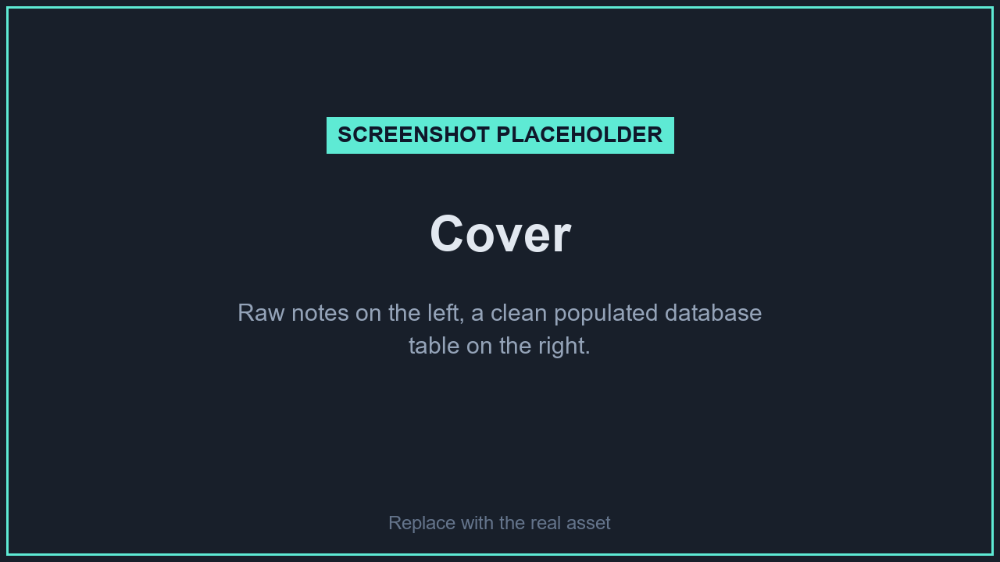

*A split image: a wall of raw meeting notes on the left, a clean database table with populated rows on the right, an arrow between them. This is the whole pitch in one frame.*

## Notes go in. Nothing comes out.

You just got out of a meeting. Three pages of notes.

Buried in there: two action items, an owner for each, a due date, a status change on a project you already track, and a budget number somebody mentioned in passing.

You know what you should do. Open your tasks database, your projects database, and your budget tracker, then copy each fact into the right row and the right column.

You also know what you will actually do. Nothing. The notes sit in a page, and by next week those action items are gone.

That gap bugged me more than anything else while I was building **My Workspace**, my self-hosted, Notion-style app. So the first feature I want to walk you through is the one that closes it: **Extract from notes**.

It does one thing and does it well. It reads your text, looks at your databases, and proposes a set of structured changes: new rows, updates to existing rows, even new columns when your notes mention something your schema does not track yet. Then it stops and waits. Nothing gets written until you check a box and click Apply.

Let me show you how it feels to use. Then let me show you exactly how it works. If you have never wired an AI model into an app before, the second half is written for you.

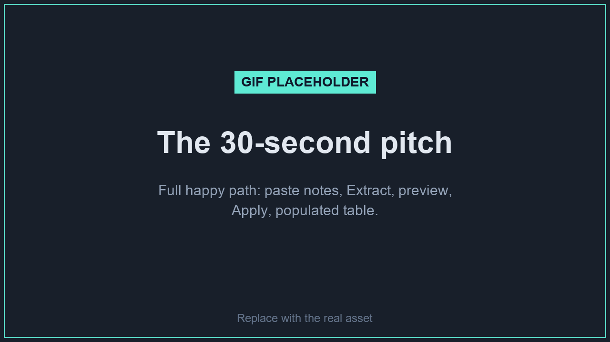

*Full happy path at speed: open modal, paste a paragraph of notes, click Extract, watch the preview populate with a mix of green "create" and blue "update" cards, click Apply, then cut to the database table now showing the new rows. Keep it under 30 seconds.*

## The whole idea in one paragraph

You open a modal. You paste your notes, or point it at a page you already wrote. You pick which databases it is allowed to touch. It sends your text, plus a short description of those databases, to a language model. The model returns a list of proposed changes. You review them, fix anything that looks off, uncheck anything you do not want, and apply. That is the entire loop.

Now the details, because the details are where this gets good.

## Using it

### Step one: pick your source

Notes do not only live in your clipboard, so the modal opens with a source picker. You get three modes:

- **Paste text.** Drop in raw notes from anywhere: a meeting, an email, a brain dump.
- **From a page.** Search your existing pages and extract from one you already wrote.
- **Recent batch.** Select several recently edited pages at once and extract across all of them in a single pass.

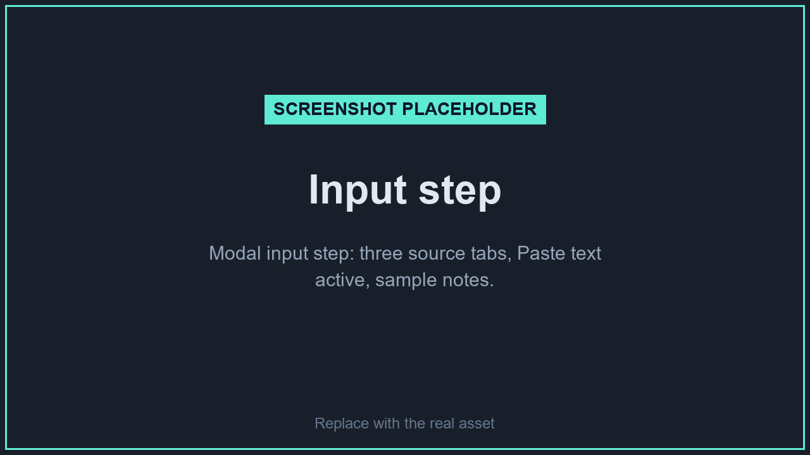

*The modal open on the input step. Show the three source tabs ("Paste text", "From a page", "Recent batch") with "Paste text" active and a paragraph of sample notes in the textarea.*

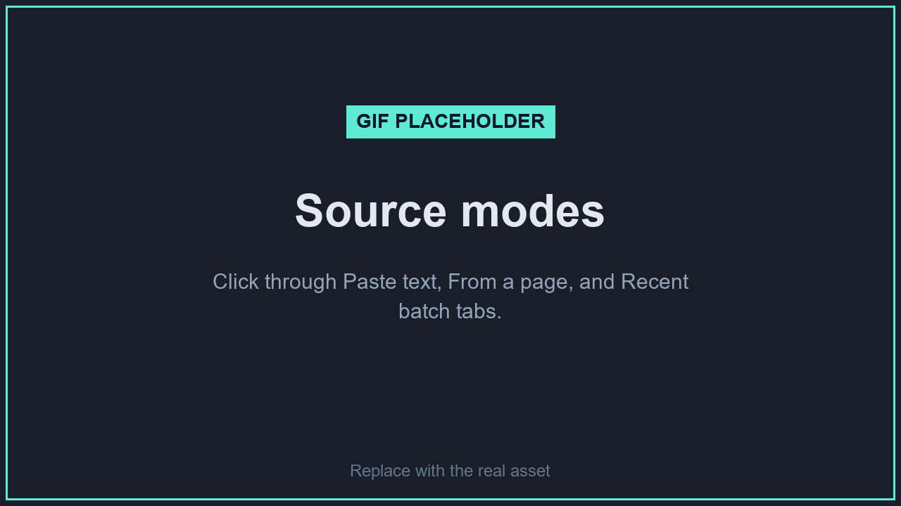

*Click through all three tabs so the reader sees the textarea swap to a page search, then to a multi-select checklist of recent pages with their icons and "last edited" dates.*

Here is a small thing that matters. When you point it at pages, the app does not ship the raw editor JSON to the model. It walks each page's block tree first and flattens it to clean plain text, adding paragraph breaks at block boundaries (headings, lists, checkboxes, quotes, code). The model sees readable prose. Garbage in, garbage out works in reverse too.

### Step two: choose what it can touch

Below the source, every database across your workspaces shows up with a checkbox, and they all start checked. This list is the model's entire universe of possible targets. Want it to leave your Budget alone and only touch Tasks and Projects? Uncheck Budget.

That is your first guardrail: the AI can never write to something you did not hand it.

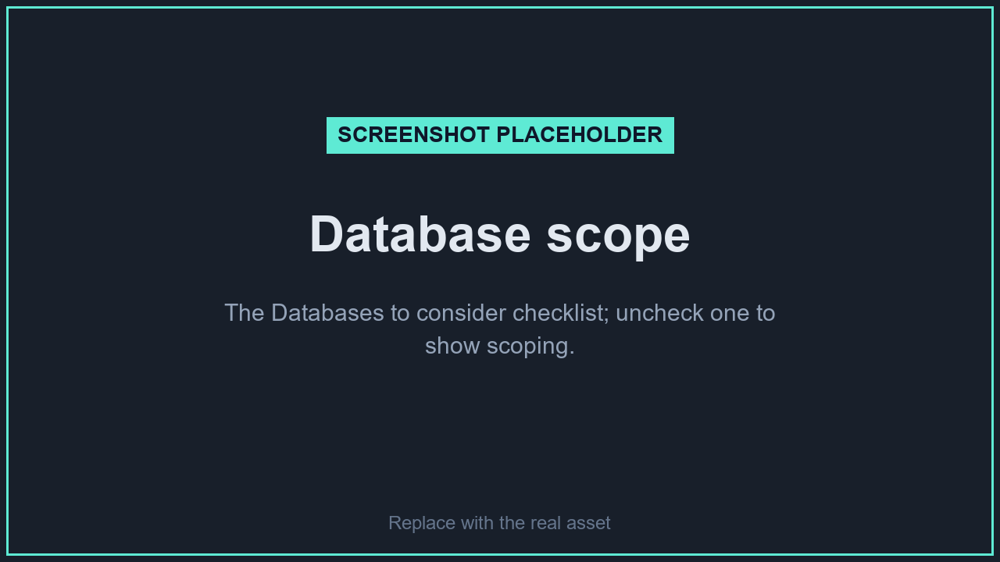

*The "Databases to consider" checklist showing several databases, each with its workspace name on the right. Uncheck one to make the scoping behavior obvious.*

Then you hit Extract. The button stays disabled until you have both a source and at least one database selected, so you cannot fire an empty request by accident.

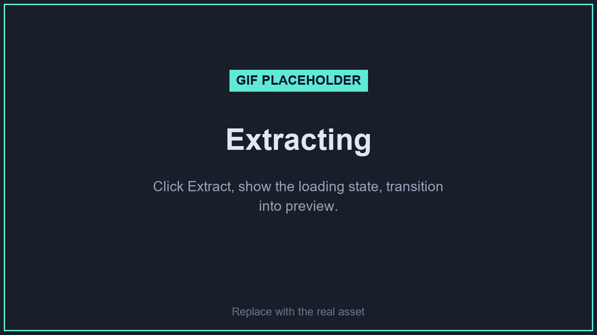

*Click Extract, show the button switch to its "Extracting…" loading state, then the modal transition into the preview step.*

### Step three: review before anything happens

This is the part I care about most, so let me say it plainly. The AI never changes your data. It writes a proposal. You are the approver.

The preview lists every proposed change as its own card. Each card tells you:

- The **action**: green for `create` (a brand new row) or blue for `update` (a change to a row that already exists).
- The **target**: which database, and either the existing page it will update or "new row".
- The **values**, as pills: each column and what the model wants to put in it.
- For new rows, an optional **context paragraph**, a short narrative the model pulled from your notes, shown as a quote.

Every card has a checkbox. There is an all-or-none toggle up top. Uncheck anything you do not like.

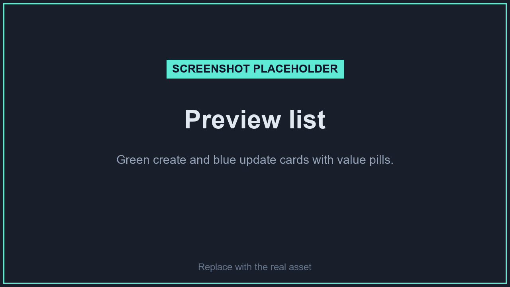

*The preview step with a healthy mix of cards: at least one green "create" card with several value pills and an italic context paragraph, and one blue "update" card pointing at an existing page title.*

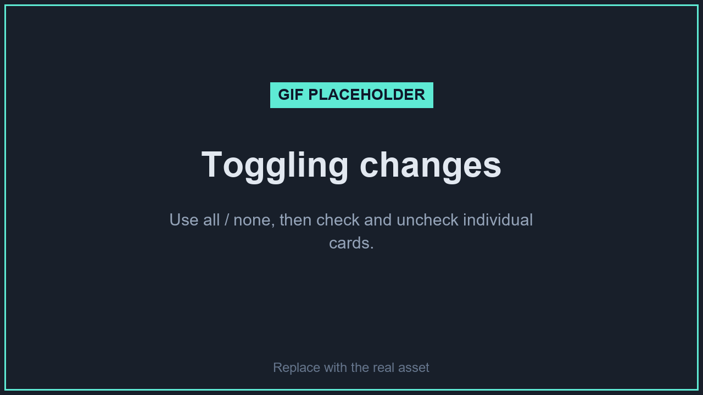

*Use the "all / none" controls, then check and uncheck a couple of individual cards so the reader sees how granular the approval is.*

### Step four: fix what the model got wrong

The model is right most of the time. "Most of the time" is a terrible standard for writing to your system of record, so every card has an Edit toggle. Flip it and the value pills turn into real form fields: a date picker for dates, a number input for numbers, a checkbox for booleans, a text field for the rest. Correct an owner, nudge a deadline, fix a typo, then apply.

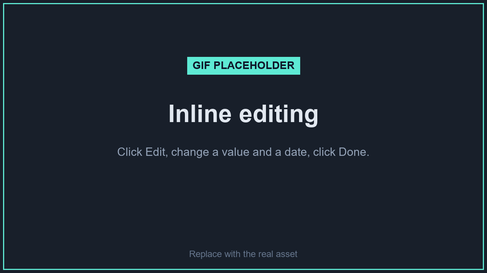

*On one card, click Edit, change a text value and pick a different date from the date picker, then click Done to return to the pill view with the edited values.*

### Step five: approve or skip new columns

This is my favorite detail. Sometimes your notes carry an attribute your database has no home for. Somebody got assigned an owner, but your Tasks database has no Owner column. Instead of dropping that fact on the floor, the model can propose a new column with a sensible type, and the app surfaces it as an approve-or-skip chip right on the card.

Each chip shows the column name and its inferred type (text, number, date, select, or checkbox). Click to skip it, click again to bring it back. Skip a column and the app also drops the value that would have gone into it, so you never end up with an orphaned value and nowhere to put it.

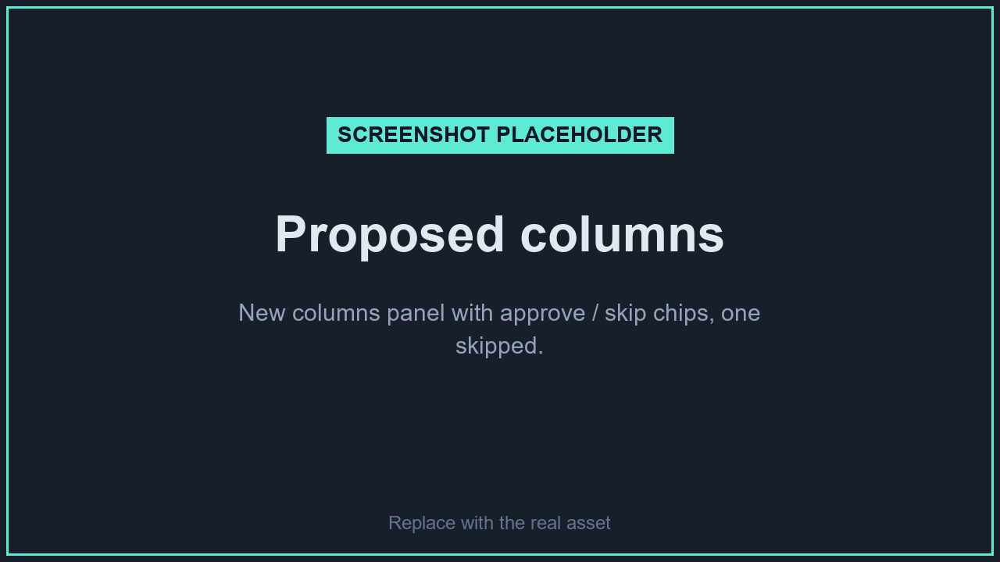

*A card with the "New columns, approve to create" panel visible, showing a couple of chips like "Owner (text)" and "Due (date)", one of them toggled to the skipped/strikethrough state.*

### Step six: apply, and read the receipts

Click Apply, and the app writes only the changes you left checked, with only the columns you approved. The last screen is a plain results list, one line per change, green for success and red for anything that failed, each with a short detail like `Created "Ship the redesign"` or `Updated "Q3 Launch"`.

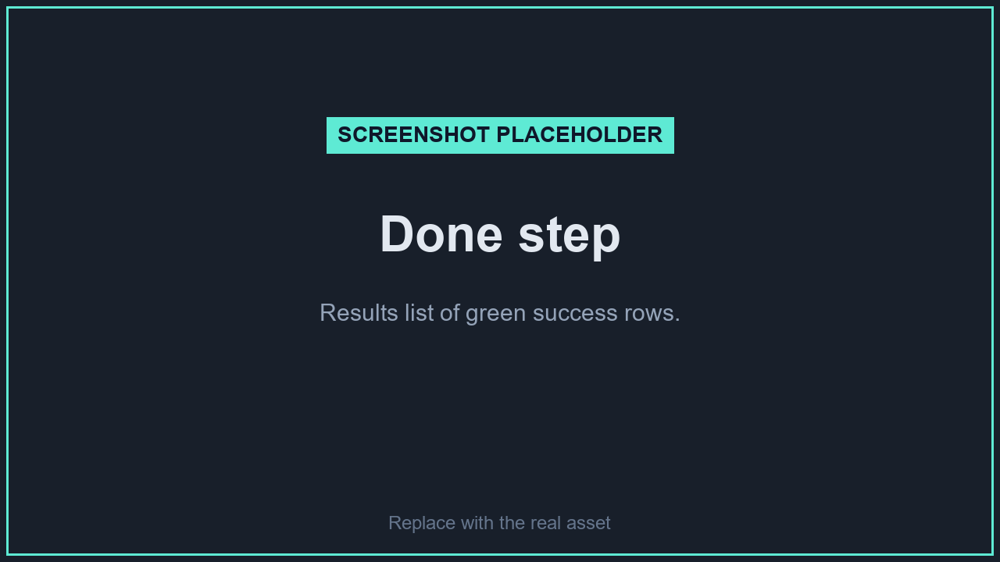

*The results step with a list of green success rows.*

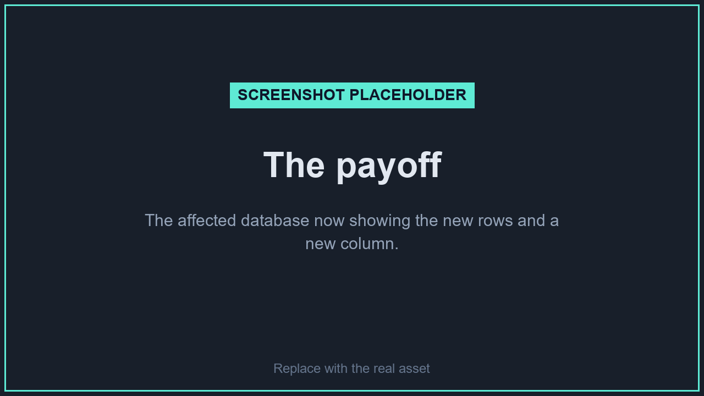

*Navigate to one of the affected databases and show the new rows sitting in the table, including a newly created column. This is the "before vs after" money shot.*

## Under the hood

That is the experience. Now the engineering, written for someone wiring a model into an app for the first time.

The whole feature is two API routes (`/api/extract` proposes changes, `/api/extract/apply` commits the ones you approve) plus the modal. The stack is Next.js (App Router) with serverless route handlers, Prisma over Neon Postgres, and DeepSeek as the model. DeepSeek speaks the same request and response shape as the OpenAI API, so almost everything here maps line for line to OpenAI, Anthropic, and most other providers.

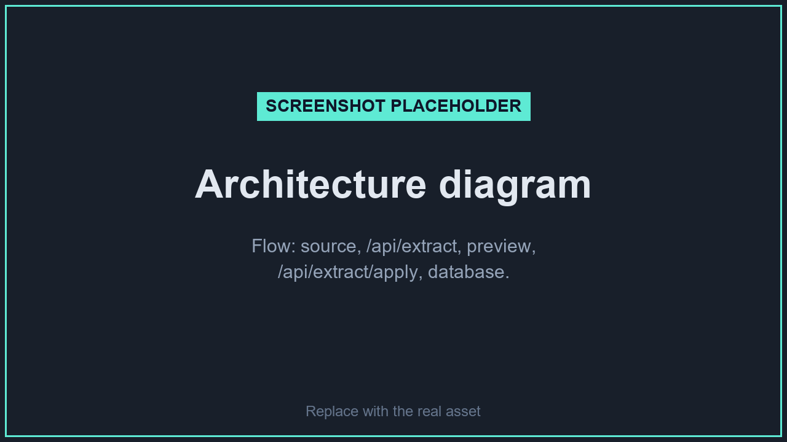

*A simple flow diagram: Source text + selected DB IDs → /api/extract (build context → DeepSeek → resolve) → Preview UI → /api/extract/apply (ownership check → create columns → write rows) → Database. Boxes and arrows, nothing fancy.*

### What "calling an AI" actually is

Here is the thing that surprises people the first time. There is no magic library doing something mysterious. Calling a large language model is an ordinary HTTPS request. You `POST` some JSON to a URL, you wait, you get JSON back. If you have ever called a REST API with `fetch`, you already know most of this.

The request describes a short conversation as a list of `messages`, each with a `role`:

- `system`: your standing instructions. This is where you tell the model what job it has and which rules to follow. The user never sees it.
- `user`: the actual input for this run. Here, that is the notes plus a description of your databases.
- `assistant`: a previous model reply, used in multi-turn chats. This feature is single-turn, so we skip it.

You send a few settings alongside the messages. The response comes back as JSON, and the one piece you care about is a single string the model generated. Hold onto that, because it shapes everything that follows. The model hands you text. Turning that text into safe, structured data is the real job.

### Flatten the page into text the model can read

When you extract from an existing page, there is a trap waiting for you. Your page is not a flat string. In a block editor it is a tree of nested JSON: paragraphs that hold text nodes, lists that hold list items that hold paragraphs, and so on down. The obvious move is to `JSON.stringify` the whole thing and send it off. Do that and you hand the model a pile of `type`, `content`, and `attrs` keys that bury the three sentences you actually care about. You pay tokens for the noise, and the model reads worse for it.

What you want is the text, with just enough structure to stay readable. So the route walks the tree and pulls the words out:

```ts
function extractTextFromBlockJson(node: any): string {
  if (!node) return '';
  if (typeof node === 'string') return node;
  if (Array.isArray(node)) return node.map(extractTextFromBlockJson).join(' ');
  if (typeof node === 'object') {
    if (typeof node.text === 'string') return node.text;
    const inner = node.content ? extractTextFromBlockJson(node.content) : '';
    // Block-level nodes get a trailing newline so paragraphs do not run together.
    const blockTypes = new Set([
      'paragraph', 'heading', 'bulletList',
      'orderedList', 'taskList', 'blockquote', 'codeBlock',
    ]);
    return blockTypes.has(node.type) ? `${inner}\n` : inner;
  }
  return '';
}
```

Read it top to bottom, because every branch is there on purpose:

- A missing node returns an empty string, so the recursion never throws on a `null`.
- A raw string returns itself. That is the base case at the bottom of the tree.
- An array maps the function over each child and joins the pieces. This is the recursive step that walks `content` arrays.
- An object with a `text` field is a leaf, the actual words in a text node, so it returns that text.
- Any other object recurses into its `content`, and if it is a block-level node (a paragraph, a heading, a list), it adds a newline so the flattened output keeps its paragraph breaks.

Out comes clean prose the model can reason over. Same information, a fraction of the tokens, none of the editor's bookkeeping. This is the boring prep that decides whether the clever part ever gets a fair shot.

### Build the context the model needs

A model cannot propose good changes if it has no idea what your databases look like. So before the call, the route loads every selected database with its columns (name and type) and a sample of up to 30 existing rows, then serializes that into a compact block, one section per database:

```
Database: "Tasks"
Columns: Name, Owner (text), Due (date), Status (select)
Rows:
  - Name: "Draft the spec", Owner: "Dejon", Due: "2026-06-10", Status: "In Progress"
  ...
```

Those sample rows are what let the model match instead of blindly creating. If your notes say "the spec is done," the model can see there is already a "Draft the spec" row and propose an update to it. Without that context, you get a duplicate.

### Make the request

Here is the actual call, trimmed only slightly:

```ts
const apiKey = process.env.DEEPSEEK_API_KEY; // secret, server-side only
if (!apiKey) {
  return NextResponse.json({ error: 'API key not configured' }, { status: 500 });
}

const aiRes = await fetch('https://api.deepseek.com/chat/completions', {
  method: 'POST',
  headers: {
    'Content-Type': 'application/json',
    Authorization: `Bearer ${apiKey}`,
  },
  body: JSON.stringify({
    model: 'deepseek-chat',
    messages: [
      { role: 'system', content: systemPrompt }, // the rules
      { role: 'user', content: userPrompt },      // the notes + DB context
    ],
    temperature: 0.1,
    max_tokens: 2048,
  }),
});
```

Take it apart field by field, because each one earns its place:

- **`Authorization: Bearer <key>`** authenticates the request. The key lives in an environment variable, and this code runs only on the server, inside a route handler. That matters more than it looks: an API key shipped to the browser is a key anyone can copy out of it. Keep it on the server. Always.
- **`model`** picks which model answers. Switching providers is mostly this line, the URL, and the header.
- **`messages`** is the conversation from above: rules in `system`, input in `user`.
- **`temperature`** controls randomness, from 0 (deterministic, the same answer every time) up toward 1 (loose and creative). Data extraction wants boring and repeatable, so it sits at `0.1`. For a poem you would turn it up.
- **`max_tokens`** caps how long the reply can run. Tokens are the chunks models read and write in, very roughly 3 to 4 characters of English each, so 2048 tokens is a few pages. The cap guards your output and your bill at the same time.

### The prompt is the program

The model only ever returns text. So the way you get reliable structure out of it is to ask for it precisely in the `system` prompt and leave almost no room to improvise. A few of the rules baked in:

- **Return JSON only.** No prose, no markdown fences, just an array of operations. (The parser still strips stray fences anyway, because models do not always listen.)
- **Match by name when confident, create otherwise, and never delete.** Deletion is not an operation the model is even allowed to emit. The blast radius of this feature stops at "add or change."
- **Treat action items as first-class.** If the notes hold N distinct tasks, the model must emit N separate `create` operations, each with the owner in an owner column, the deadline as an ISO date (relative dates like "next Friday" get resolved against today, which is injected into the prompt), and a short body capturing that one item's context.
- **Propose columns sparingly.** A new column is allowed only when a real attribute has no existing home, never to restate a title or body.
- **Respect types.** Numbers for number columns, ISO strings for dates, booleans for checkboxes.

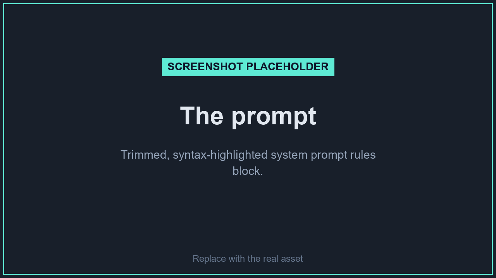

*A trimmed, syntax-highlighted snippet of the system prompt showing the rules block. Good for readers who want to see the actual instructions.*

A useful instinct for beginners: when the output is wrong, reach for the prompt before the code. Most of the behavior lives in those instructions, and tightening a rule beats writing more parsing logic almost every time.

### The model hands you a string. Parse it like you do not trust it.

This is the step first-timers skip, then get burned by. The API response is JSON, but the model's answer is a string inside it, and that string is only JSON because you asked nicely. Treat it as untrusted text:

```ts
const aiJson = await aiRes.json();
if (aiJson.usage) logDeepSeek('extract', aiJson.usage, userId); // track token cost
const raw = aiJson.choices?.[0]?.message?.content ?? '[]';

let proposed;
try {
  // Models sometimes wrap JSON in markdown code fences despite being told not to.
  const cleaned = raw
    .replace(/^```[a-z]*\n?/i, '')
    .replace(/\n?```$/i, '')
    .trim();
  proposed = JSON.parse(cleaned);
  if (!Array.isArray(proposed)) proposed = [];
} catch {
  return NextResponse.json({ error: 'AI returned invalid JSON', raw }, { status: 502 });
}
```

Three habits worth stealing:

- **Strip code fences defensively.** Even with "return JSON only" in the prompt, models sometimes wrap the answer in triple backticks. Removing them before parsing turns a frequent crash into a non-event.
- **Wrap `JSON.parse` in try / catch.** Sometimes the text is not valid JSON at all. When that happens you hand back a clean error instead of throwing a 500 in the user's face.
- **Validate the shape.** A successful parse does not mean you got an array of operations. The `Array.isArray` check is the floor. The next step does the real validation.

See that `logDeepSeek(...)` line? Easy to skip, worth keeping. The API tells you how many tokens each call burned, and recording that per user is how an AI feature avoids turning into a surprise invoice. Build cost visibility in on day one.

### Verify everything against reality

Parsing gives you a plausible-looking list of operations. It does not give you correct ones. The model can name a database that does not exist, reference a column you never created, or claim to update a row that is not there. So the route treats every proposal as a claim to check against the real schema. For each operation it:

- Looks up the named database in a case-insensitive map and throws out anything pointing at a database that is not in scope.
- Builds a `propertyMap` from the database's real columns so values can be written later by their resolved property ID.
- Spots any key that does not match an existing column and turns it into a proposed column with a validated type (falling back to inferring the type from the value if the model did not give one).
- For updates, resolves the model's match target to a real page, exact title first, then case-insensitive. If nothing matches, it drops the update rather than guess.

Two of those bullets deserve a closer look.

**Resolve names to stable IDs.** The model speaks in column names, because names are all it was shown. Names are a shaky thing to write to a database by: they get renamed, they collide, they vary by capitalization. So the route resolves every name to the column's stable ID once, up front:

```ts
const propertyMap: Record<string, PropertyInfo> = {};
for (const p of db.properties) {
  propertyMap[p.name] = { id: p.id, type: p.type };
}
```

From there on, every write looks up `propertyMap[name]` and uses the `id`. The model's loose, human-friendly names get translated into something the database can trust, and that translation lives in exactly one place.

**Catch attributes that have no column yet.** When the model puts a value under a key your schema does not have, that is a signal worth catching. The route finds those keys and proposes a column, guessing a type from the value when the model did not name one:

```ts
const inferType = (v: unknown): string => {
  if (typeof v === 'boolean') return 'checkbox';
  if (typeof v === 'number') return 'number';
  if (typeof v === 'string' && /^\d{4}-\d{2}-\d{2}/.test(v)) return 'date';
  return 'text';
};

for (const key of Object.keys(dataObj)) {
  if (key === 'Name' || propertyMap[key]) continue; // already a real column
  const type = inferType(dataObj[key]);
  proposedColumns.push({ name: key, type });
}
```

A boolean becomes a checkbox, a number becomes a number, a string that looks like `2026-06-10` becomes a date, and everything else falls back to text. The guess is only a default. The user sees it on the card and can skip the column or pick a different type. The machine proposes a structure, the human signs off on it.

What reaches the UI is a fully resolved, schema-aware change set with real database IDs, page IDs, and property maps attached. The model proposed. The server verified.

### Write carefully

The apply route is where writes finally happen, and it is deliberately paranoid:

- **Ownership gets re-checked on the server.** It gathers every database ID in the change set and confirms you own all of them before touching anything. The client cannot smuggle in a database ID it does not own.
- **Approved columns are created first, and only once.** If three changes all want a new "Owner" column, it gets created a single time and reused. Existing columns are detected and never duplicated.
- **Updates upsert property values** by `(propertyId, pageId)`, and if the title changed, the page title updates too.
- **Creates** make a new row, write each value, and if the model returned a context paragraph, drop it on the new page as a real text block so the entry carries narrative alongside its structured cells.
- **Every change is wrapped on its own**, so one failure cannot abort the batch. Each returns its own ok-or-error result.

The one primitive that pulls the most weight here is the upsert. An update should not have to care whether a value already exists for that column on that row. Writing that branch by hand (check, then either `create` or `update`) is exactly the kind of code that grows bugs and races. Prisma folds it into a single call keyed on the `(propertyId, pageId)` pair:

```ts
await prisma.propertyValue.upsert({
  where: { propertyId_pageId: { propertyId: prop.id, pageId: change.pageId } },
  update: { value: rawValue },
  create: { propertyId: prop.id, pageId: change.pageId, value: rawValue },
});
```

Value already there? It updates. First time? It creates. One call, no branch you have to maintain, no gap between checking and writing.

Now step back and look at the shape of the whole feature. The hard part of building with an AI is that the model is loose and your database is strict, and those two facts pull against each other. The split here is what settles it. `/api/extract` does all the loose, fuzzy, sometimes-wrong work and hands back a plain proposal. `/api/extract/apply` does nothing fuzzy at all: owner-checked, type-correct, idempotent writes. The model gets to be creative where creativity helps, and the database stays trustworthy where trust matters. You get both.

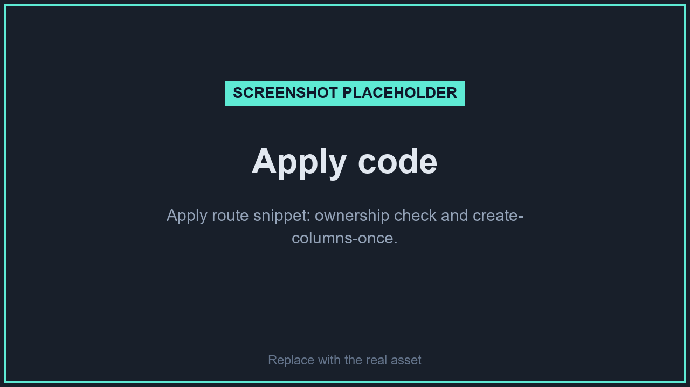

*A short snippet of the apply route showing the ownership check and the "create columns once" logic.*

## Why I made you the approver

I could have made this one click. Paste notes, walk away, let it write to your databases on its own. I chose not to, on purpose.

Think about where a language model is strong and where it is dangerous. It is great at the boring, error-prone part: reading prose and mapping it to fields. It is shaky at the part where mistakes are expensive: committing to your system of record. The preview step drops the human into exactly the spot where a human is worth the most, as the approver, while the model does the tedious mapping.

You get the speed of automation and you keep the final say. Stack that on top of "never delete," "owner-checked writes," and "you choose the scope," and the worst case for a bad extraction is an extra row you uncheck. Corrupted data is off the table.

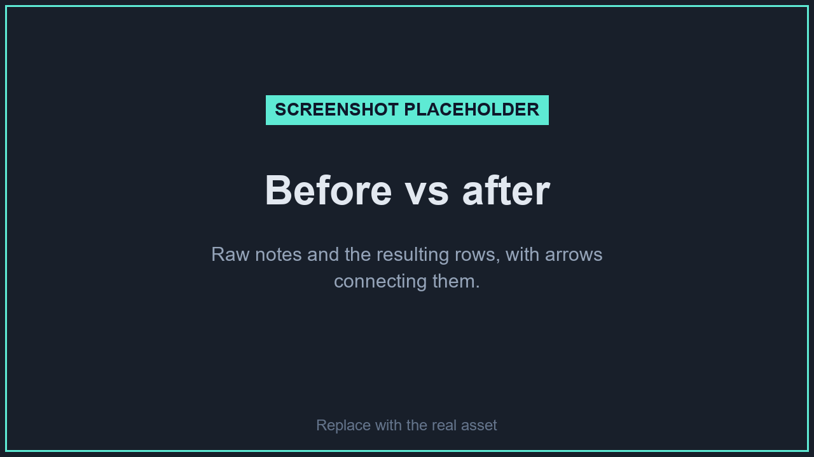

*Side by side: the raw notes paragraph on the left, the resulting database rows on the right, with arrows connecting a sentence to the row it produced. A clean summary image for sharing.*

## Where it falls short

A few honest limits, because every feature has them:

- **The model only sees a sample.** It reads up to 30 rows per database for matching. In a database with thousands of rows, a match target outside that window gets missed, and you will see a duplicate `create` to uncheck.
- **Matching is name-based.** Two rows with very similar names can fool it. Inline editing and the per-change checkboxes are your safety valve.
- **The token budget is finite.** Very long notes across many large databases can hit the cap. The "Recent batch" mode is there so you can scope inputs on purpose.
- **It only adds and changes.** Removing or merging rows is a manual job. That is intentional.

## What's next

A few directions I am chewing on:

- Confidence scores per change, so low-confidence rows start unchecked.
- Embedding-based matching, so a match no longer depends on the row landing in the sampled window.
- An "undo last extraction" that reverses a whole applied batch in one click.

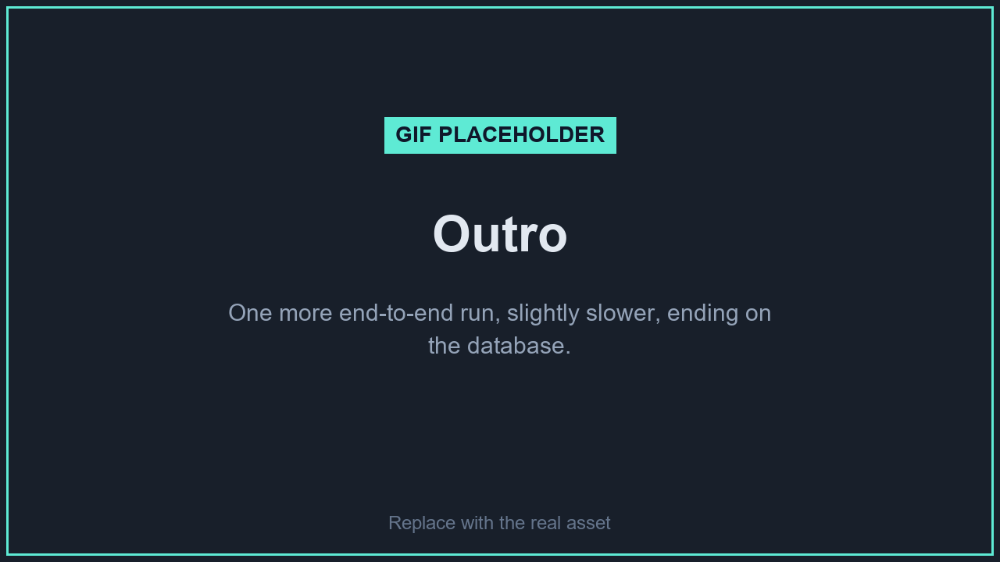

*One more end-to-end run on a real set of notes, slightly slower than the pitch GIF, ending on the populated database. Good closing visual.*

## Try it

My Workspace runs on Vercel and Neon for about $0/month for personal use. Of everything in it, Extract from notes is the feature I reach for most. It is the line between notes that rot and notes that turn into tracked work.

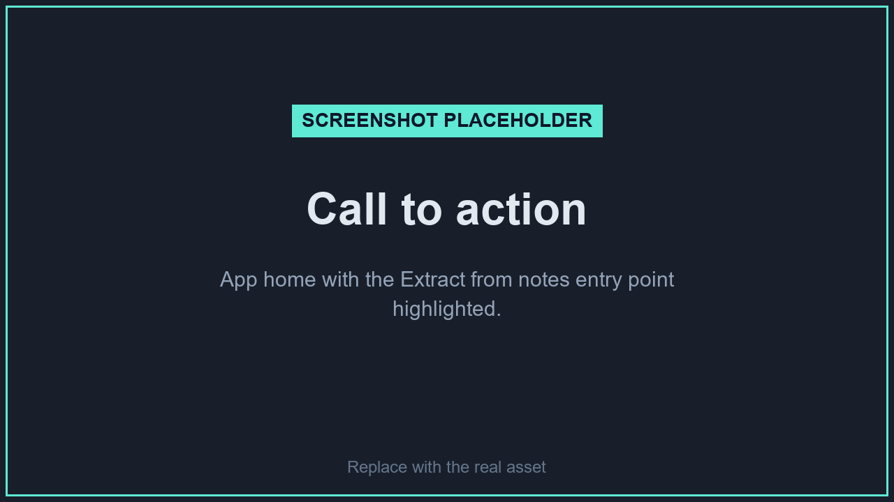

*The app's home/workspace view with the "Extract from notes" entry point highlighted, so readers know where to find it.*

Got notes that never make it into your trackers? That is the exact gap this was built to close. Go feed it a messy paragraph and watch what comes back.
